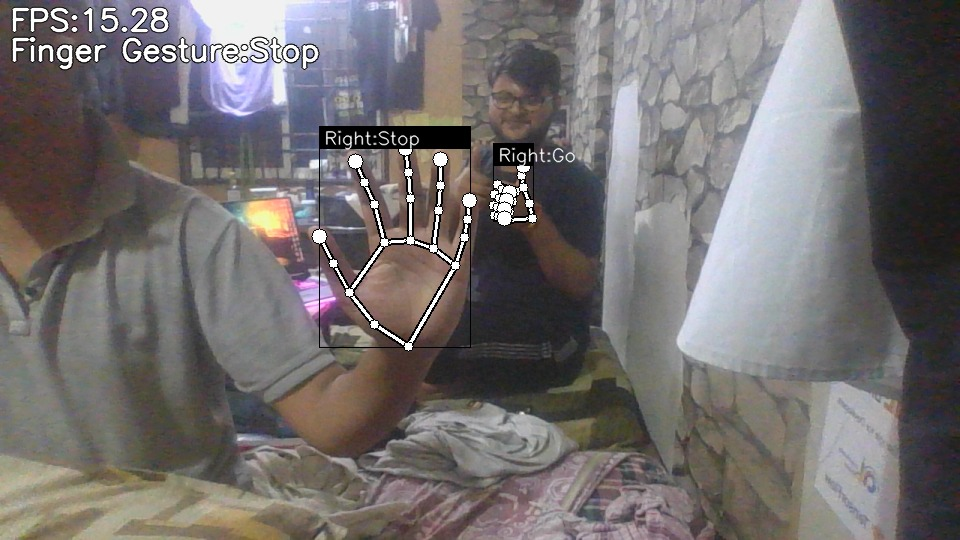
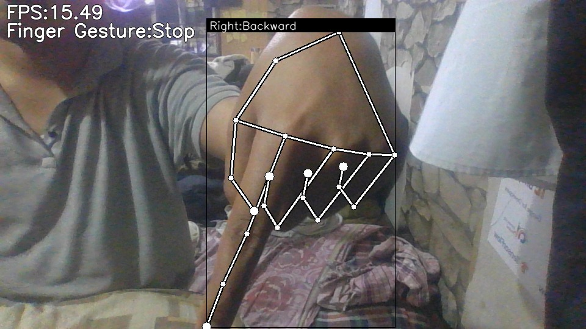
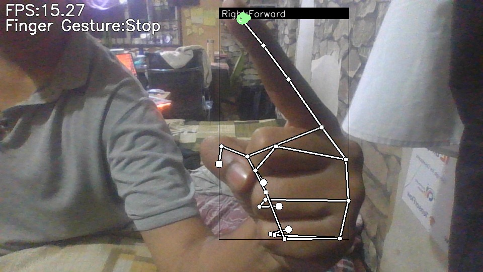
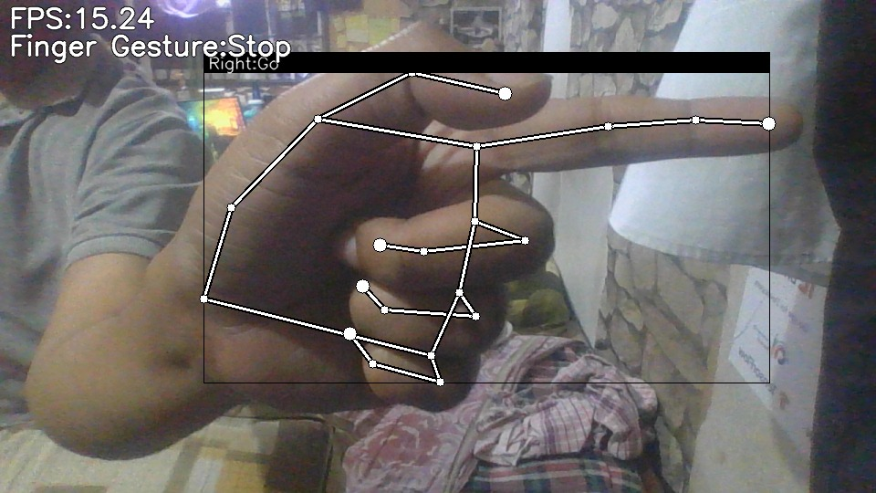
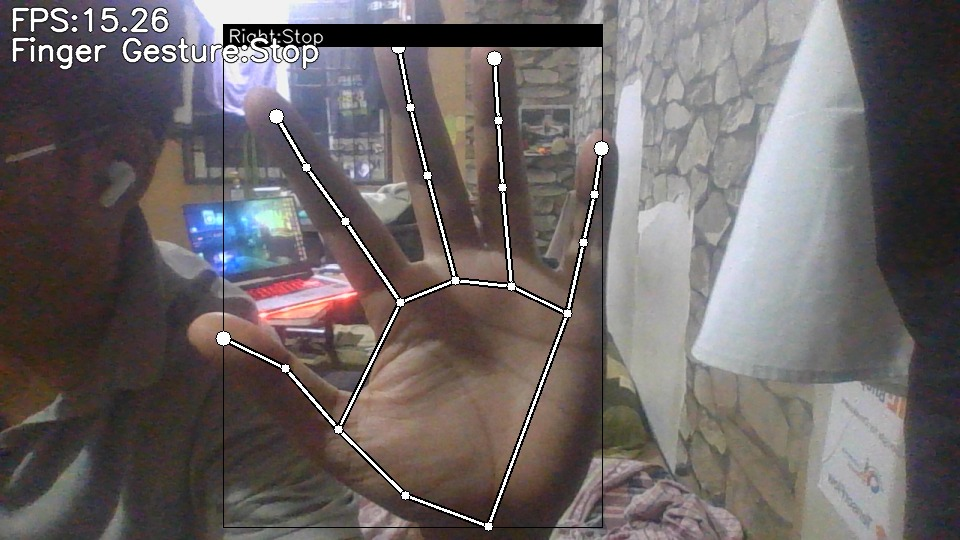
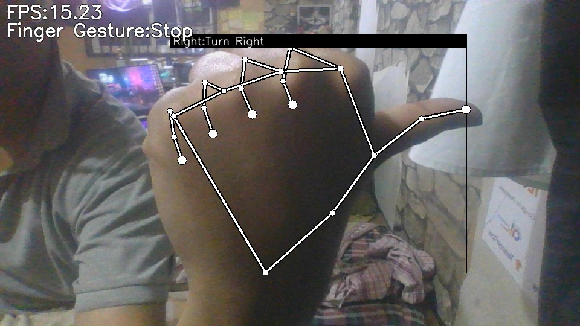

# Hand Gesture Recognition

Hand Gesture Recognition is a Python-based project that uses computer vision and machine learning to detect and classify hand gestures in real-time. This project leverages MediaPipe and TensorFlow to recognize various hand gestures, which can be used for applications such as controlling devices, interacting with virtual environments, or recognizing sign language.

---

## Table of Contents

-   [Features](#features)
-   [Prerequisites](#prerequisites)
-   [Installation](#installation)
    -   [Using Virtual Environment](#using-virtual-environment)
    -   [Regular Installation](#regular-installation)
-   [Usage](#usage)
-   [Examples](#examples)
-   [Project Structure](#project-structure)
-   [How It Works](#how-it-works)
-   [Technologies Used](#technologies-used)
-   [Contributing](#contributing)
-   [License](#license)
-   [Repository](#repository)

---

## Features

-   Real-time hand gesture detection and classification using webcam input
-   Support for multiple hand gestures including:
    -   Turn left/right
    -   Forward/backward
    -   Go/stop
    -   Multiple hands detection
-   Visual feedback with landmarks and bounding boxes
-   Pre-trained models for immediate use
-   Training notebooks for custom gesture recognition
-   Cross-platform compatibility (Windows, Linux, MacOS)

---

## Prerequisites

-   Python 3.7 or higher
-   Webcam (built-in or external)
-   Git (for cloning the repository)
-   Basic understanding of Python (for customization)

---

## Installation

### Using Virtual Environment

1. Clone the repository:

    ```bash
    git clone https://github.com/Sambhavi374/Hand_gesture_recognitionation.git
    cd Hand_gesture_recognitionation
    ```

2. Create and activate a virtual environment:

    ```bash
    # For Linux/MacOS
    python -m venv venv
    source venv/bin/activate

    # For Windows
    python -m venv venv
    venv\Scripts\activate
    ```

3. Install the required dependencies:

    ```bash
    pip install -r requirements.txt
    ```

4. Verify the installation:
    ```bash
    python camera_test.py
    ```
    This will test if your camera is properly connected and accessible.

### Regular Installation

1. Clone the repository:

    ```bash
    git clone https://github.com/Sambhavi374/Hand_gesture_recognitionation.git
    cd Hand_gesture_recognitionation
    ```

2. Install the required dependencies:

    ```bash
    pip install -r requirements.txt
    ```

3. Ensure you have Python 3.7 or higher installed.

---

## Usage

1. After installation, you can run the application using:

    ```bash
    python app.py
    ```

2. Alternatively, you can use the main.py entry point:

    ```bash
    python main.py
    ```

3. For camera testing to ensure your webcam is properly connected:

    ```bash
    python camera_test.py
    ```

### Gesture Controls

The application recognizes the following hand gestures:

-   **Turn Left**: Used to indicate a left turn command
-   **Turn Right**: Used to indicate a right turn command
-   **Forward**: Signals forward movement
-   **Backward**: Signals backward movement
-   **Go**: Signals to start or proceed
-   **Stop**: Signals to stop the current action
-   **Multiple Hand Detection**: The system can detect and track multiple hands simultaneously

### Custom Training

To train or customize the gesture recognition models, use the provided Jupyter notebooks:

1. For keypoint-based gesture recognition:

    ```bash
    jupyter notebook keypoint_classification.ipynb
    ```

2. For point history-based gesture recognition:
    ```bash
    jupyter notebook point_history_classification.ipynb
    ```

These notebooks provide step-by-step instructions for:

-   Collecting your own gesture data
-   Training custom models
-   Saving and deploying the trained models

### Troubleshooting

If you encounter issues:

1. **Camera access problems**:

    - Ensure your webcam is properly connected
    - Check if other applications are using the camera
    - Run `python camera_test.py` to verify camera access

2. **Dependency issues**:

    - Make sure all dependencies are correctly installed
    - Ensure you're using a compatible Python version (3.7+)
    - If using a virtual environment, verify it's activated

3. **Performance issues**:
    - Consider reducing the video resolution in the app.py file
    - Close other resource-intensive applications
    - For better performance, use a computer with a dedicated GPU

---

## Examples

Here are some examples of the hand gestures detected by the application:

### Turn Left Gesture


### Multiple Hands Detected



### Right Hand - Backward Gesture



### Right Hand - Forward Gesture



### Right Hand - Go Gesture



### Right Hand - Stop Gesture



### Turn Right Gesture



---

## Project Structure

```
Hand_gesture_recognitionation/
├── app.py                     # Main application script for hand gesture recognition
├── camera_test.py             # Script to test camera functionality
├── gesture_recognizer.task    # Task configuration for the gesture recognizer
├── keypoint_classification.ipynb   # Notebook for training keypoint classifier
├── main.py                    # Alternative entry point for the application
├── point_history_classification.ipynb  # Notebook for training point history classifier
├── requirements.txt           # List of Python dependencies
├── demos/                     # Example images for gestures demonstration
│   ├── gesture:turn_left.jpeg
│   ├── multiple_hands.jpeg
│   ├── right_backward.jpeg
│   ├── right_forward.jpeg
│   ├── right_go.jpeg
│   ├── right_stop.jpeg
│   └── turn_right.jpeg
├── model/                     # Model-related files
│   ├── keypoint_classifier/   # Keypoint classification models and data
│   │   ├── keypoint_classifier_label.csv  # Labels for keypoint classifier
│   │   ├── keypoint_classifier.keras      # Keras model
│   │   ├── keypoint_classifier.py         # Classifier implementation
│   │   ├── keypoint.csv                   # Training data
│   │   └── models/                        # TFLite model for deployment
│   │       └── keypoint_classifier.tflite
│   └── point_history_classifier/          # Point history classification models
│       ├── point_history_classifier_label.csv  # Labels for point history
│       ├── point_history_classifier.hdf5       # HDF5 model format
│       ├── point_history_classifier.keras      # Keras model
│       ├── point_history_classifier.py         # Classifier implementation
│       ├── point_history_classifier.tflite     # TFLite model for deployment
│       └── point_history.csv                   # Training data
└── utils/                     # Utility functions
    └── cvfpscalc.py           # FPS calculation utility
```

---

## How It Works

1. **MediaPipe** is used for hand detection and tracking.
2. **TensorFlow** is used for loading the pre-trained models and classifying the gestures.
3. The application captures video from the webcam, processes each frame to detect hands, and then classifies the gestures based on the hand landmarks.

---

## Technologies Used

-   Python
-   OpenCV
-   MediaPipe
-   TensorFlow
-   Jupyter Notebook

---

## Contributing

Contributions are welcome! If you'd like to contribute, please follow these steps:

1. Fork the repository.
2. Create a new branch for your feature or bug fix:
    ```bash
    git checkout -b feature-name
    ```
3. Commit your changes:
    ```bash
    git commit -m "Add feature-name"
    ```
4. Push to your branch:
    ```bash
    git push origin feature-name
    ```
5. Open a pull request.

---

## License

This project is licensed under the MIT License. See the [LICENSE](LICENSE) file for details.

---

## Repository

This project is available on GitHub: [https://github.com/Sambhavi374/Hand_gesture_recognitionation]
